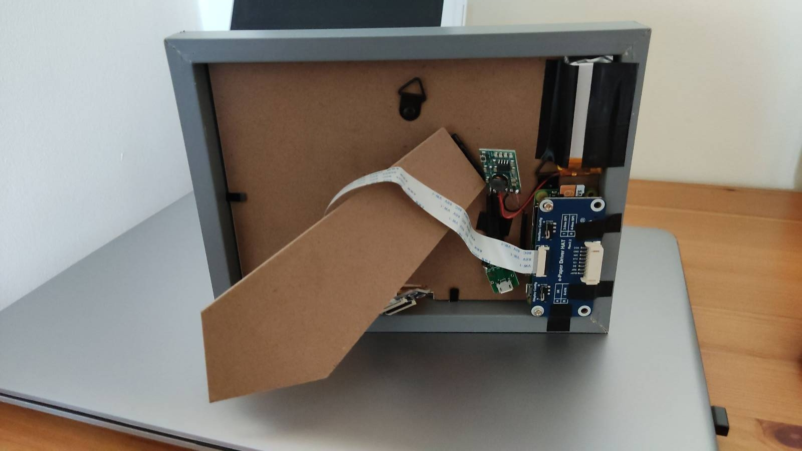

# Raspberry Pi Weather Station
> A simple weather station written using Python.

## Table of Contents
* [General Info](#general-information)
* [Technologies Used](#technologies-used)
* [Features](#features)
* [Screenshots](#screenshots)
* [Setup](#setup)
* [Usage](#usage)
* [Autostart](#autostart)
* [Room for Improvement](#room-for-improvement)
<!-- * [License](#license) -->

## General Information
- I decided to create my own weather station using Python, Raspberry Pi and Waveshare's eink 7.5inch display (red/black). 
- Waveshare's documentation was confusing and it was hard for me to understand how the screen works.
- I will try to explain here, step by step how to get it up and running on your Pi!
- I used this tutorial how to add battery to the Pi (<a href="https://www.youtube.com/watch?v=opYVS0EXZIg">https://www.youtube.com/watch?v=opYVS0EXZIg</a>

## Technologies Used
- Raspberry Pi Zero W
- Waveshare Eink Display 7.5inch e-Paper HAT (HD, red & black colour)
- Python
- 3.7V 1000mAh battery
- 2A Lithium Li-ion 18650 3.7V Battery Charger Module DC 5V Converter
- USB Micro board (for battery charging)

## Prerequisites
- PIL
- Requests
- Datetime
- API key for Openweathermap

## Features
- Current forecast
- Forecast for the next 12 hours
- Location
- Refresh time

## Screenshots

## Setup
Make sure to enable GPIO and SPI by using: 
>sudo raspi-config 

However I strongly suggest to use Raspberry Pi Imager for the initial setup of your SD card - you can enable GPIO, SSH and configure WiFi 
Following the instructions from Waveshare 
- Install BCM2835 libraries 
>wget http://www.airspayce.com/mikem/bcm2835/bcm2835-1.71.tar.gz && tar zxvf bcm2835-1.71.tar.gz && cd bcm2835-1.71 && sudo ./configure && sudo make && sudo make check && sudo make install 

- Install WiringPi libraries 
>sudo apt-get install git && git clone https://github.com/WiringPi/WiringPi && cd WiringPi && ./build && gpio -v

- Install Python3 
>sudo apt-get update && sudo apt-get install python3-pip python3-pil python3-numpy && sudo pip3 install RPi.GPIO spidev requests

- Clone the repo
>cd && git clone https://github.com/KayetanMatysiak/Pi-Weather-Station.git

## Usage
You only need to provide latitude and longitude (lines 36 and 37), I suggest using: 
<a href='https://www.latlong.net/'>https://www.latlong.net/</a>  
You also need to use your own API key from Openweathermap (line 38)  

Remember to unhash line 4 & 142 and hash 143. It's to import Waveshare's code, push it to the display and avoid generating image in the jpg file.

## Autostart
I tried using rc.local and crontab - for some reason the first one was causing glitches on the screen and crontab had a problem with auto shutdown. 
The best to accomplish the goal is to use systemd.  

In order to do that, we need to create a new service: 
>sudo nano /etc/systemd/system/my_script.service 

Paste the code below: 
>[Unit] 
>Description=My_Script Service 
>After=multi-user.target  

>[Service] 
>Type=idle 
>User=pi 
>ExecStart=/usr/bin/python3 /home/pi/weather_station/launcher.sh  

>[Install] 
>WantedBy=multi-user.target 

Change the file permissions: 
>sudo chmod 644 /etc/systemd/system/name-of-your-service.service 

Reload and enable the system: 
>sudo systemctl daemon-reload 
>sudo systemctl enable /etc/systemd/system/my_script.service  

You may also need to change the permissions for the shutdown service as well as the Python code (including fonts)!

