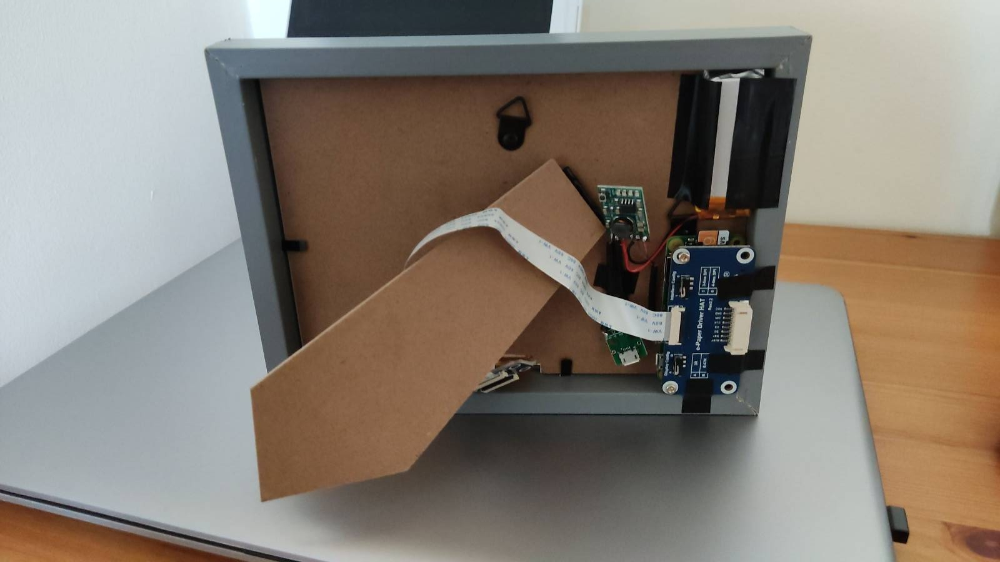

# Raspberry Pi Weather Station
> A simple weather station written using Python.

## Table of Contents
* [General Info](#general-information)
* [Technologies Used](#technologies-used)
* [Features](#features)
* [Screenshots](#screenshots)
* [Setup](#setup)
* [Configuration](#configuration)
* [Google Calendar](#google-calendar-optional)
* [Local news](#local-news-optional)
* [Troubleshooting](#troubleshooting)
* [Usage](#usage)
* [Autostart](#autostart)
* [Room for Improvement](#room-for-improvement)
<!-- * [License](#license) -->

## General Information
- I decided to create my own weather station using Python, Raspberry Pi and Waveshare's eink 7.5inch display (red/black). 
- Waveshare's documentation was confusing and it was hard for me to understand how the screen works.
- I will try to explain here, step by step how to get it up and running on your Pi!
- I used this tutorial how to add battery to the Pi (<a href="https://www.youtube.com/watch?v=opYVS0EXZIg">https://www.youtube.com/watch?v=opYVS0EXZIg</a>

## Technologies Used
- Raspberry Pi Zero W
- Waveshare Eink Display 7.5inch e-Paper HAT (HD, red & black colour)
- Python
- 3.7V 1000mAh battery
- 2A Lithium Li-ion 18650 3.7V Battery Charger Module DC 5V Converter
- USB Micro board (for battery charging)

## Prerequisites
- PIL
- Requests
- Datetime
- API key for Openweathermap
- Optional (Google Calendar): `google-api-python-client`, `google-auth`, `google-auth-oauthlib`
- Optional (local news): `feedparser`

All of them can be installed with:
>pip3 install -r requirements.txt

## Features
- Current forecast
- Forecast for the next 12 hours
- Location
- Refresh time
- Optional Google Calendar agenda (disabled by default)
- Optional local news headlines from your own RSS feeds (disabled by default)

## Screenshots

## Setup
Make sure to enable GPIO and SPI by using: 
>sudo raspi-config 

However I strongly suggest to use Raspberry Pi Imager for the initial setup of your SD card - you can enable GPIO, SSH and configure WiFi 
Following the instructions from Waveshare 
- Install BCM2835 libraries 
>wget http://www.airspayce.com/mikem/bcm2835/bcm2835-1.71.tar.gz && tar zxvf bcm2835-1.71.tar.gz && cd bcm2835-1.71 && sudo ./configure && sudo make && sudo make check && sudo make install 

- Install WiringPi libraries 
>sudo apt-get install git && git clone https://github.com/WiringPi/WiringPi && cd WiringPi && ./build && gpio -v

- Install Python3 
>sudo apt-get update && sudo apt-get install python3-pip python3-pil python3-numpy && sudo pip3 install RPi.GPIO spidev requests

- Clone the repo
>cd && git clone https://github.com/KayetanMatysiak/Pi-Weather-Station.git

## Usage
You only need to provide latitude and longitude (lines 36 and 37), I suggest using: 
<a href='https://www.latlong.net/'>https://www.latlong.net/</a>  
You also need to use your own API key from Openweathermap (line 38)  

Remember to unhash line 4 & 142 and hash 143. It's to import Waveshare's code, push it to the display and avoid generating image in the jpg file.

## Configuration
Both extra panels are optional and disabled by default - without a configuration file the station
behaves exactly as before and shows 12 hours of forecast.

To enable them, copy the example file and edit your own copy (it is git-ignored, so no secrets are committed):
>cp config.example.json config.json

Available options:

| Section | Key | Description |
| --- | --- | --- |
| `weather` | `lat`, `lon`, `appid`, `units` | Optional overrides for the values in `main.py`. Leave empty to keep the values already set in the code. |
| `calendar` | `enabled` | Set to `true` to show the agenda panel. |
| `calendar` | `calendar_id` | Calendar to read, `primary` by default. |
| `calendar` | `credentials_file` / `token_file` | OAuth client secrets and the token created on the first run. |
| `calendar` | `max_events`, `lookahead_days` | How many upcoming events to show and how far ahead to look. |
| `calendar` | `timezone` | IANA timezone (e.g. `Europe/Madrid`). Empty means the Pi's local timezone. |
| `calendar` | `max_title_length` | Event titles longer than this are truncated. |
| `news` | `enabled` | Set to `true` to show the news panel. |
| `news` | `feeds` | List of RSS/Atom URLs of *your* local news provider - no provider is hard coded. |
| `news` | `max_headlines`, `max_headline_length`, `headline_lines` | Number of headlines and how they are truncated/wrapped for the e-ink display. |
| `news` | `show_source`, `timeout` | Show the feed name/publication time, and the network timeout in seconds. |

When at least one panel is enabled, the bottom half of the screen is used for the panels and the
forecast shows the next 6 hours instead of 12. The image is only pushed to the e-ink display when
its content actually changed (a hash is stored in `.display_state`), which avoids needless refreshes.

## Google Calendar (optional)
1. Open the <a href="https://console.cloud.google.com/">Google Cloud Console</a> and create (or pick) a project.
2. Enable the **Google Calendar API** for that project.
3. Configure the OAuth consent screen (External + add your own Google account as a test user).
4. Create credentials of type **OAuth client ID** -> **Desktop app** and download the JSON file.
5. Copy that file next to `main.py` as `credentials.json` (git-ignored, never commit it).
6. Set `calendar.enabled` to `true` in `config.json` and run `python3 main.py` once **on a machine with a browser**
   (or over SSH with X forwarding). Authorise the read-only access; a `token.json` is written and reused afterwards,
   so later runs on the headless Pi need no interaction. You can also authorise on a desktop and copy
   `token.json` to the Pi.

The requested scope is read-only (`calendar.readonly`). If credentials are missing, expired without a refresh
token, or the API call fails, an error is printed, the agenda stays empty and the weather display keeps working.

## Local news (optional)
1. Find the RSS/Atom feed URL(s) of your local news site (often linked as "RSS" in the footer).
2. Add them to `news.feeds` in `config.json` and set `news.enabled` to `true`.
3. Headlines are cleaned from HTML, truncated and wrapped to fit the e-ink panel; when several feeds are
   configured, the headlines are spread evenly between them. A feed that is unreachable or malformed is
   skipped and simply logged.

## Tests
The tests only cover parsing, formatting and configuration logic - they need no credentials, no feeds and no network:
>python3 -m unittest discover -s tests

## Troubleshooting
- **`ModuleNotFoundError: google...` / `feedparser`** - install the optional dependencies with `pip3 install -r requirements.txt`, or set the feature back to `enabled: false`.
- **Nothing happens on the display** - the content is identical to the previous refresh; delete `.display_state` to force a redraw.
- **Calendar panel says "No upcoming events"** - no event within `lookahead_days`, a wrong `calendar_id`, or the token expired; delete `token.json` and re-authorise.
- **`Google OAuth client secrets not found`** - `credentials.json` is missing or `calendar.credentials_file` points to the wrong path.
- **Wrong event times** - set `calendar.timezone` to your IANA timezone.
- **News panel empty** - check the feed URL in a browser; the console output shows the parsing/network error.
- **Config changes ignored** - `config.json` must be valid JSON and live in the directory the script is started from; parse errors are printed at startup.

## Autostart
I tried using rc.local and crontab - for some reason the first one was causing glitches on the screen and crontab had a problem with auto shutdown. 
The best to accomplish the goal is to use systemd.  

In order to do that, we need to create a new service: 
>sudo nano /etc/systemd/system/my_script.service 

Paste the code below: 
>[Unit] 
>Description=My_Script Service 
>After=multi-user.target  

>[Service] 
>Type=idle 
>User=pi 
>ExecStart=/usr/bin/python3 /home/pi/weather_station/launcher.sh  

>[Install] 
>WantedBy=multi-user.target 

Change the file permissions: 
>sudo chmod 644 /etc/systemd/system/name-of-your-service.service 

Reload and enable the system: 
>sudo systemctl daemon-reload 
>sudo systemctl enable /etc/systemd/system/my_script.service  

You may also need to change the permissions for the shutdown service as well as the Python code (including fonts)!

